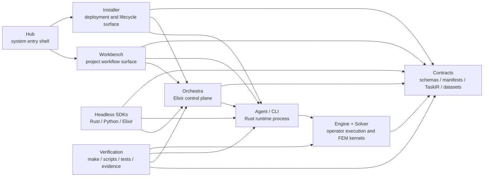

# Current Architecture Map

This is the compact architecture map for the current `moxi 2.0.x` line.
Use it before diving into the deeper boundary documents.

Kyuubiki is not one application. It is a contract-first FEM system made of
product shells, a control plane, runtime data-plane components, SDK clients,
shared contracts, and verification lanes.

## Layer Map

## Product Shells

`Hub` is the desktop entrypoint and operator shell.

- Owns global workload posture, docs shelf, launch routing, and runtime
  visibility.
- Must not become the workflow editor or deployment authoring tool.

`Workbench` is the engineering workflow surface.

- Owns project workflow UX, operator graph authoring, study setup, result
  inspection, browser automation, and WebView/mobile-compatible GUI behavior.
- Must not own runtime installation, fleet topology, or solver internals.

`Installer` is the deployment and lifecycle surface.

- Owns install, repair, update, cleanup, component integrity, remote bootstrap,
  certificates, host trust, and runtime layout visibility.
- Must not become an engineering workspace.

## Control Plane

`Orchestra` is the Elixir/Phoenix control-plane workload under `apps/web`.

It owns:

- HTTP APIs
- workflow catalog and graph execution
- job lifecycle and persistence
- result storage and chunk delivery
- TaskIR preparation and execution envelopes
- multi-agent coordination and watchdog-style control-plane work

It is a managed workload, not the whole platform. Hub may launch or observe it,
but Orchestra should not absorb product-shell duties or installer authority.

## Runtime Data Plane

The Rust runtime data plane is split across protocol, agent/CLI, engine,
solver, installer, and benchmark crates under `workers/rust`.

Main responsibilities:

- `protocol`: language-neutral RPC payloads, TaskIR, digests, and summaries
- `cli`: agent process, command surfaces, RPC handling, direct mesh entrypoints
- `engine`: reusable operator/workflow execution helpers
- `solver`: FEM kernels, sparse linear algebra, accuracy-sensitive routines
- `installer`: native install/update/repair/package-preflight logic
- `benchmark`: runtime and solver performance evidence tooling

The data plane should execute protocol payloads. It should not know React
component structure, Hub navigation, or Installer panel hierarchy.

## SDK And Extension Surfaces

There are two different SDK ideas, and they must stay separate.

`Headless SDKs` are clients.

- Rust, Python, and Elixir SDKs let automation, AI agents, and batch workflows
  drive Kyuubiki without the frontend.
- They should expose protocol-first workflows, not duplicate engines.

`Worker / Operator SDK` is for extending executable operators.

- The Rust operator SDK and templates define how new operator packages are
  described, preflighted, loaded, and dispatched.
- It should produce runtime-compatible packages and descriptors, not frontend
  plugins.

Pwdt, short for Python WASM DSL Tooling, is separate again. It automates the
fixed Workbench UI surface through Pyodide and stable selector contracts. It
should not be treated as the headless Python SDK.

Current Pwdt surface status:

- `Workbench`: full console implemented, with Pyodide execution, DSL compile,
  macro recording, action catalog, snippets, and bridge assets.
- `Hub`: launcher/stub surface only. It may copy Python macro stubs or open
  Workbench, but it is not a Pyodide execution host.
- `Installer`: planned restricted diagnostics surface only. It must stay limited
  to installer-safe actions if/when Pwdt is exposed there.

## Contracts

Contracts are the system language shared by GUI, control plane, runtime agents,
SDKs, installer, and verification.

Important contract families:

- JSON schemas under `schemas/`
- TaskIR and execution-program contracts
- workflow graph and workflow dataset contracts
- operator package manifests and reliability manifests
- UI automation selectors
- language packs
- benchmark and material research evidence artifacts

If two layers need to share behavior, prefer a contract addition over a layer
collapse.

## Runtime Modes

`orchestrated_gui`

- Workbench talks to Orchestra.
- Orchestra schedules jobs and talks to agents.
- Best for persistent projects, central coordination, and administrative flows.

`direct_mesh_gui`

- Workbench talks directly to LAN/headless agents through defined gateways.
- Best for keeping Phoenix out of the hot solver path.

`headless`

- SDKs, CLIs, or batch jobs drive Orchestra or agents without GUI involvement.
- Best for automation, AI-driven research loops, and remote lab execution.

`offline_peer_mesh`

- Agents can operate without a central Orchestra when authority mode allows it.
- Must not silently mix with orchestrated authority.

## Authority Rules

- One agent is either unbound, bound to one Orchestra, or in an explicit offline
  mesh mode.
- Agents should not accept simultaneous control from multiple Orchestras.
- Operator libraries are logically centralized at the owning Orchestra or
  source; agents fetch what they need instead of carrying every package forever.
- GUI surfaces may show the same runtime facts, but ownership of actions must
  stay separate.

## Verification Spine

Verification is part of the architecture, not an afterthought.

Core gates:

- `make architecture-check`
- `./scripts/kyuubiki audit-project-organization`
- `make check-ui-automation-contract`
- `make check-operator-reliability`
- `make audit-dependencies`
- `cargo test` for Rust crates
- ExUnit and integration smoke for control-plane paths
- benchmark profile and shape checks for solver/runtime pressure evidence

The machine-readable topology lives in:

- `config/architecture/module-topology.json`
- `config/architecture/module-function-coverage-matrix.json`
- `config/architecture/module-function-coverage-tensor.json`

The tensor is the three-axis review map:

- module
- function paradigm
- evidence depth

## Repository Ownership Map

- `apps/hub-gui`: Hub desktop shell
- `apps/frontend`: browser Workbench
- `apps/workbench-gui`: native Workbench wrapper
- `apps/installer-gui`: Installer desktop shell
- `apps/desktop-shared`: source-of-truth UI assets synchronized into the three independent desktop shells
- `apps/web`: Orchestra control plane
- `workers/rust/crates/protocol`: shared runtime contracts
- `workers/rust/crates/cli`: Rust agent and CLI process
- `workers/rust/crates/engine`: execution helpers and operator host logic
- `workers/rust/crates/solver`: FEM kernels
- `workers/rust/crates/installer`: native install/update/integrity logic
- `workers/rust/crates/headless-sdk`: Rust headless client SDK
- `sdks`: language SDKs
- `schemas`: JSON contracts
- `config`: topology, capability, reliability, and policy manifests
- `make` and `scripts`: verification and operational entrypoints
- `docs`: source-of-truth narrative, mirrored selectively into Hub

## Current Architecture Risks

The main risks are not only missing features. They are boundary drift risks:

- Hub absorbing Workbench or Installer responsibilities
- Workbench depending on runtime internals instead of contracts
- Orchestra becoming a hidden god object
- headless SDKs drifting away from GUI workflow semantics
- operator SDK, headless SDK, and frontend DSL terminology collapsing together
- runtime files growing into mixed-responsibility modules
- benchmark evidence claiming more than it actually measured

Keep [architecture-red-lines.md](architecture-red-lines.md) close when adding
cross-layer features.

## Reading Path

After this map, read:

1. [module-architecture.md](module-architecture.md)
2. [project-architecture-organization.md](project-architecture-organization.md)
3. [app-runtime-boundaries.md](app-runtime-boundaries.md)
4. [agent-orchestrator-boundary.md](agent-orchestrator-boundary.md)
5. [headless-agent-contract.md](headless-agent-contract.md)
6. [operator-sdk.md](operator-sdk.md)
7. [headless-sdks.md](headless-sdks.md)
8. [workflow-graph.md](workflow-graph.md)
9. [workflow-dataset.md](workflow-dataset.md)
10. [testing-and-ci.md](testing-and-ci.md)
