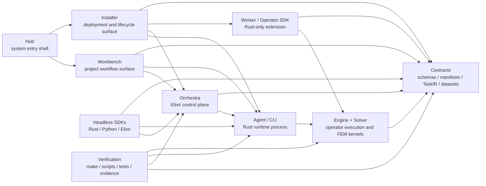

# Current Architecture Map

This is the compact architecture map for the current `daji 3.x` line.
Use it before diving into the deeper boundary documents.

Kyuubiki is not one application. It is a contract-first FEM system made of
product shells, a control plane, runtime data-plane components, SDK clients,
shared contracts, and verification lanes.

## Layer Map

```mermaid
flowchart LR
  Hub["Hub\nsystem entry shell"]
  Workbench["Workbench\nproject workflow surface"]
  Installer["Installer\ndeployment and lifecycle surface"]
  SDK["Headless SDKs\nRust / Python / Elixir"]
  OperatorSDK["Worker / Operator SDK\nRust-only extension"]
  Control["Orchestra\nElixir control plane"]
  Agent["Agent / CLI\nRust runtime process"]
  Engine["Engine + Solver\noperator execution and FEM kernels"]
  Contracts["Contracts\nschemas / manifests / TaskIR / datasets"]
  Verify["Verification\nmake / scripts / tests / evidence"]

  Hub --> Workbench
  Hub --> Installer
  Workbench --> Control
  Workbench --> Agent
  SDK --> Control
  SDK --> Agent
  OperatorSDK --> Engine
  Installer --> Agent
  Installer --> Control
  Installer --> OperatorSDK
  Control --> Agent
  Agent --> Engine
  Engine --> Contracts
  Control --> Contracts
  SDK --> Contracts
  OperatorSDK --> Contracts
  Workbench --> Contracts
  Installer --> Contracts
  Verify --> Contracts
  Verify --> Control
  Verify --> Agent
  Verify --> Engine
```

## Product Shells

`Hub` is the desktop entrypoint and operator shell.

- Owns global workload posture, docs shelf, launch routing, and runtime
  visibility.
- Must not become the workflow editor or deployment authoring tool.

`Workbench` is the engineering workflow surface.

- Owns project workflow UX, operator graph authoring, study setup, result
  inspection, browser automation, and WebView/mobile-compatible GUI behavior.
- Must not own runtime installation, fleet topology, or solver internals.

`Installer` is the deployment and lifecycle surface.

- Owns install, repair, update, cleanup, component integrity, remote bootstrap,
  certificates, host trust, and runtime layout visibility.
- Must not become an engineering workspace.

## Control Plane

`Orchestra` is the Elixir/Phoenix control-plane workload under `apps/web`.

It owns:

- HTTP APIs
- workflow catalog and graph execution
- job lifecycle and persistence
- result storage and chunk delivery
- TaskIR preparation and execution envelopes
- multi-agent coordination and watchdog-style control-plane work

It is a managed workload, not the whole platform. Hub may launch or observe it,
but Orchestra should not absorb product-shell duties or installer authority.

## Runtime Data Plane

The Rust runtime data plane is split across protocol, agent/CLI, engine,
solver, installer, and benchmark crates under `workers/rust`.

Main responsibilities:

- `protocol`: language-neutral RPC payloads, TaskIR, digests, solver capability
  admission, and qualification-report validation
- `cli`: agent process, command surfaces, RPC handling, direct mesh entrypoints,
  and admitted TaskIR solver dispatch into the Engine
- `engine`: reusable operator/workflow execution helpers
- `solver`: FEM kernels, sparse linear algebra, accuracy-sensitive routines
- `installer`: native install/update/repair/package-preflight logic
- `benchmark`: runtime and solver performance evidence tooling

The data plane should execute protocol payloads. It should not know React
component structure, Hub navigation, or Installer panel hierarchy.

The Agent-native TaskIR solver surface explicitly advertises `solve.bar_1d`,
`solve.modal_frame_2d`, and `solve.modal_frame_3d` through the headless bridge's
`solver_execution_capability`. Typed adapters dispatch into Engine, not an
Agent-owned solver implementation. Built-in entrypoint names must match their
operator IDs. Retained qualification remains bar-scoped; the modal routes have
[bounded local macOS live-TCP verification](../reports/modal-agent-taskir-reliability-20261002.md),
not installed/remote qualification. Other direct RPC solvers are not implicitly
promoted into the TaskIR capability allowlist.

Within Solver, `modal_normalization.rs` owns the shared, range-checked sparse
entry traversal used by the dense Jacobi matrix and prepared inverse matrix.
Dense allocation owns its existing 4096-DOF guard; constructing that matrix
does not replay the sparse operator once per column. This changes neither
Agent admission nor the original physical residual acceptance gates. See the
[bounded normalization evidence](../reports/modal-normalization-reliability-20261002.md);
the local debug timings are not whole-solver or remote throughput qualification.

`modal_sparse_product.rs` also owns staged-product admission and finite-vector
checks. `modal_sparse_product_range.rs` balances the four physical factors for
extreme-scale products without caching a second matrix or using the rounded
normalized matrix as a residual oracle. The ordinary CSR product retains its
operation order; both routes support cancellation and leave the operator
unchanged for replay. See the [bounded range and replay evidence](../reports/modal-sparse-product-range-reliability-20261002.md).

## SDK And Extension Surfaces

There are two different SDK ideas, and they must stay separate.

`Headless SDKs` are clients.

- Rust, Python, and Elixir SDKs let automation, AI agents, and batch workflows
  drive Kyuubiki without the frontend.
- They should expose protocol-first workflows, not duplicate engines.

`Worker / Operator SDK` is for extending executable operators.

- The Rust operator SDK and templates define how new operator packages are
  described, preflighted, loaded, and dispatched.
- It should produce runtime-compatible packages and descriptors, not frontend
  plugins.

Pwdt, short for Python WASM DSL Tooling, is separate again. It automates the
fixed Workbench UI surface through Pyodide and stable selector contracts. It
should not be treated as the headless Python SDK.

Current Pwdt surface status:

- `Workbench`: full console implemented, with Pyodide execution, DSL compile,
  macro recording, action catalog, snippets, and bridge assets.
- `Hub`: launcher/stub surface only. It may copy Python macro stubs or open
  Workbench, but it is not a Pyodide execution host.
- `Installer`: planned restricted diagnostics surface only. It must stay limited
  to installer-safe actions if/when Pwdt is exposed there.

## Contracts

Contracts are the system language shared by GUI, control plane, runtime agents,
SDKs, installer, and verification.

Important contract families:

- JSON schemas under `schemas/`
- the native `.kyuubiki` project container implementation under
  `workers/rust/crates/project-bundle`, shared by Hub and native command tools
- the native `.kcore` frozen computation exchange implementation under
  `workers/rust/crates/kcore`, shared by native commands, SDK adapters, stores,
  and third-party readers without exposing editable project state
- the native project automation adapter under
  `workers/rust/crates/project-automation`, which compiles stored presets and
  standalone macro files into Rust headless SDK plans and fail-closed execution
  reports
- TaskIR and execution-program contracts
- workflow graph and workflow dataset contracts
- operator package manifests and reliability manifests
- UI automation selectors
- language packs
- benchmark and material research evidence artifacts

If two layers need to share behavior, prefer a contract addition over a layer
collapse.

## Runtime Modes

`orchestrated_gui`

- Workbench talks to Orchestra.
- Orchestra schedules jobs and talks to agents.
- Best for persistent projects, central coordination, and administrative flows.

`direct_mesh_gui`

- Workbench talks directly to LAN/headless agents through defined gateways.
- Best for keeping Phoenix out of the hot solver path.

`headless`

- SDKs, CLIs, or batch jobs drive Orchestra or agents without GUI involvement.
- Best for automation, AI-driven research loops, and remote lab execution.

`offline_peer_mesh`

- Agents can operate without a central Orchestra when authority mode allows it.
- Must not silently mix with orchestrated authority.

## Authority Rules

- One agent is either unbound, bound to one Orchestra, or in an explicit offline
  mesh mode.
- Agents should not accept simultaneous control from multiple Orchestras.
- Operator libraries are logically centralized at the owning Orchestra or
  source; agents fetch what they need instead of carrying every package forever.
- GUI surfaces may show the same runtime facts, but ownership of actions must
  stay separate.

## Verification Spine

Verification is part of the architecture, not an afterthought.

Core gates:

- `make architecture-check`
- `./scripts/kyuubiki audit-project-organization`
- `make check-ui-automation-contract`
- `make check-operator-reliability`
- `make audit-dependencies`
- `cargo test` for Rust crates
- ExUnit and integration smoke for control-plane paths
- benchmark profile and shape checks for solver/runtime pressure evidence

The machine-readable topology lives in:

- `config/architecture/module-topology.json`
- `config/architecture/module-function-coverage-matrix.json`
- `config/architecture/module-function-coverage-tensor.json`

The tensor is the three-axis review map:

- module
- function paradigm
- evidence depth

Tensor v5 splits evidence depth into required-dimension strength, explicit
scenario qualification, and release criticality. The October 4, 2026 retained
evidence review updates the profile to `daji 3.4.x` at checkpoint `daji 3.4.5`;
it preserves all 224 claims and does not rerun their product journeys. It does
not promote registered test commands into
execution evidence, and takes the weakest required dimension rather than the
highest claim.
Named platform/backend/language/recovery obligations cannot inherit proof from
unrelated scenarios. Structural success remains distinct from readiness during
the advisory phase. Of 77 required coordinates, 58 meet every configured target;
ten of 32 explicit scenarios meet their named targets. Current modal candidate
research and local timings cannot close production recovery, multimode,
whole-pipeline budget or actual Agent/Headless scopes. See the
[current recalibration](book-ch03-architecture-boundaries.html#tensor-calibration).

The subsequent bounded horizontal modal request-reassembly correction adds one
verified claim (225 total), with original-numbering restoration owned by Solver.
It does not alter Engine/Agent contracts or close the qualified reassembly,
production recovery, pipeline-budget or study-journey scopes. See the
[bounded production follow-up](book-ch03-architecture-boundaries.html#modal-request-reassembly-follow-up).

The later [banded candidate follow-up](book-ch03-architecture-boundaries.html#modal-banded-candidate-follow-up)
adds a separate verified validation claim (226 total). Six-of-six candidate
recovery is not production admission; no Engine/Agent ownership changes.
Its [separate cost follow-up](../reports/modal-banded-inverse-pipeline-cost-20261004.md)
measures borrowed final-only initialization and both candidate correction stages,
without adding a claim or qualifying complete production work/memory budgets.
The [subsequent lower-cap comparison](../reports/modal-banded-ranked-policy-cost-20261004.md)
retains all six candidate results while bounding each stage to two fits/thirteen
checks; paired per-case regressions prevent treating it as universal acceleration.
The [checked-order handoff](../reports/modal-banded-checked-order-handoff-20261004.md)
then limits the physical proposal to one independently checked fit, with no
fallback. Its strategy tag is not a transferred permutation or certificate;
all six exact readbacks and unchanged production gaps remain explicit.

The [rebuilt candidate request follow-up](../reports/modal-banded-handoff-request-reassembly-20261004.md)
checks 24 fresh layouts and eighteen material changes without transferring
numerical policy into Engine/Agent. Two tiny-layer material inputs still reject
all three separate physical routes; private test restoration and healthy replay
do not qualify public production recovery or general request reassembly.

The [cold inward-chart candidate](../reports/modal-material-inward-chart-reliability-20261004.md)
passes 52 rebuilt/readback requests over 24 material inputs, including both
counterexamples, with one physical fit and no reference seed. It stays within
Solver's test-only ancestry; baseline residual regression and unchanged
production/whole-budget/Agent/SDK obligations prevent promotion by this evidence.

The [independent recipe/mesh holdouts](../reports/modal-material-holdout-reliability-20261004.md)
then compare 36 inputs through 72 fresh cold routes. Both charts accept the same
31 inputs and retain four internal plus one physical rejection; sixteen improved
and fifteen regressed inward margins do not justify a universal default or
close any production qualification scope.

The [wide-factor range comparison](../reports/modal-wide-givens-range-reliability-20261004.md)
keeps a separate cold Givens factor inside test-only Solver ancestry, sharing
scaled-column preflight and backsolve while preserving all range/certificate
guards. Its isolated normalized gains and regressions are not physical result
publication, a composed pipeline budget or Engine/Agent strategy admission.

The [internal-chart construction comparison](../reports/modal-internal-chart-construction-reliability-20261004.md)
shares chart preparation only inside Solver's test ancestry, retaining separate
internal-direction and physical-unit-shape contracts. It gains one request and
loses another over 108 cold routes; per-policy counts stay 31 of 36. No numerical
selection, extra retry or ownership change is added to Engine/Agent.

The [banded finite-box construction](../reports/modal-banded-grid-construction-reliability-20261004.md)
stays in test-only Solver ancestry. Structural bandwidth bounds the frontier
to 729 states without a dense factor; one/four-pass cumulative work and payload
are separately reserved. Only actual operator receipts can accept directions.
Nine holdout normalized successes and zero old-baseline recoveries do not
qualify physical output, arbitrary topology or Engine/Agent strategy admission.

The [rounded-beam follow-up](../reports/modal-amplitude-rounded-beam-reliability-20261004.md)
keeps at most 64 partial integer decisions and certifies each completed proposal
through the actual operator. It shares the unchanged physical publication tail
with old test-only policies. Normalized gains do not imply physical recovery:
the 100-member difficult input still rejects after unit restoration. Engine,
Agent, runtime retries and production qualification remain unchanged.

The [physical-first joint experiment](../reports/modal-physical-first-joint-reliability-20261005.md)
also remains inside Solver's test ancestry. Physical residual drives bounded
proposals, but acceptance additionally requires rounded internal re-encoding
at the original initializer anchor. This stronger condition is absent from the
old publication contract: 42 fresh inputs yield 37 old acceptances versus one
GridNorm and two Reverse acceptances. Neither this negative comparison nor
paired-product/publication cancellation replay changes Engine/Agent ownership.

The [coupled two-stage follow-up](../reports/modal-coupled-shape-selection-reliability-20261005.md)
instead retains the old contract: actual internal certification precedes
independent physical recovery, with no post-physical internal re-encoding.
Mapped physical error is only an internal-selection hint. Separate bounded
fits, final unit norm, original-numbered JSON reassembly and cancellation/replay
remain inside test-only Solver ownership. One new physical recovery alongside
two GridNorm old-success losses does not qualify a production strategy or
move algorithm selection into Engine/Agent.

The [legacy-first hybrid follow-up](../reports/modal-legacy-first-hybrid-reliability-20261005.md)
keeps the old internal policy and reuses one physical factor for greedy then,
only after numerical residual rejection, bounded beam recovery. Old accepted
outputs are retained rather than replaced by lower ranking hints: 37 exact
old JSON results plus one new success, with four hard internal failures open.
Faults, cancellation, stale final eligibility and norm loss stop. One physical
fit/twenty-five receipts and exact recovery replay remain test-only Solver
evidence, not a new Engine/Agent retry mechanism or production qualification.

The [breadth and iteration follow-up](../reports/modal-breadth-iteration-reliability-20261005.md)
adds one preselected internal construction after old numerical exhaustion,
without replacing any of the 38 old JSON outputs or counts. Three internal
fits/79 receipts and the unchanged one-fit/25-receipt physical stage recover
one tiny ThreeLayers input, for 39 of 42 completed readbacks. Narrower repeated
passes do not gain the same physical output; three 128-member internal failures
remain. Cumulative fixed-grid radius, faults, final gates and fresh exact replay
stay test-only Solver concerns, not Engine/Agent retries or production scopes.

The [bounded lattice follow-up](../reports/modal-bounded-lattice-reliability-20261005.md)
keeps integer swaps/shears and all search ownership inside test-only Solver.
Explicit step or coefficient limits retain only a whole safe transformation;
arithmetic faults and cancellation stop. Two alternate physical readbacks
on one already recovered input do not add distinct coverage: 39 of 42 remain,
with three internal failures. Wider per-construction work reservations and
independent final receipts do not qualify whole-pipeline production budgets.

The moxi 2.15 calibration has 13 modules and 11 paradigms. It assigns
`workers/rust/crates/operator-sdk` and `workers/rust/templates` to the dedicated
`sdk-operator` module, adds the `sdk_operator` paradigm and ABI-compatibility
dimension, and keeps the Headless SDK family as a separate control-client path.
The recalibrated Daji queue is intentionally non-empty where only source-tree
or single-platform evidence exists.

## Repository Ownership Map

- `apps/hub-gui`: Hub desktop shell
- `apps/frontend`: browser Workbench
- `apps/workbench-gui`: native Workbench wrapper
- `apps/installer-gui`: Installer desktop shell
- `apps/desktop-shared`: source-of-truth UI assets synchronized into the three independent desktop shells
- `apps/web`: Orchestra control plane
- `workers/rust/crates/protocol`: shared runtime contracts
- `workers/rust/crates/project-bundle`: shared native project container
  creation, inspection, validation, normalization, packing, unpacking, and diff
- `workers/rust/crates/project-automation`: shared automation-preset lookup,
  standalone macro validation, payload/state template binding, risk planning,
  and service execution adapter
- `workers/rust/crates/cli`: Rust agent and CLI process
- `workers/rust/crates/engine`: execution helpers and operator host logic
- `workers/rust/crates/solver`: FEM kernels
- `workers/rust/crates/installer`: native install/update/integrity logic
- `workers/rust/crates/operator-sdk`: Rust-only Worker/Operator authoring,
  package, readiness, registry, and host ABI surface
- `workers/rust/templates`: external-local Rust operator starter packages
- `workers/rust/crates/headless-sdk`: Rust headless client SDK
- `workers/rust/crates/cli/src/bin/kyuubiki-headless.rs`: official native
  template discovery, workflow normalization, planning, validation, dry-run,
  and service execution entrypoint
- `sdks`: language SDKs
- `schemas`: JSON contracts
- `config`: topology, capability, reliability, and policy manifests
- `make` and `scripts`: verification and operational entrypoints
- `docs`: source-of-truth narrative, mirrored selectively into Hub

## Current Architecture Risks

The main risks are not only missing features. They are boundary drift risks:

- Hub absorbing Workbench or Installer responsibilities
- Workbench depending on runtime internals instead of contracts
- Orchestra becoming a hidden god object
- headless SDKs drifting away from GUI workflow semantics
- operator SDK, headless SDK, and frontend DSL terminology collapsing together
- runtime files growing into mixed-responsibility modules
- benchmark evidence claiming more than it actually measured

Keep [architecture-red-lines.md](architecture-red-lines.md) close when adding
cross-layer features.

## Reading Path

After this map, read:

1. [module-architecture.md](module-architecture.md)
2. [project-architecture-organization.md](project-architecture-organization.md)
3. [app-runtime-boundaries.md](app-runtime-boundaries.md)
4. [agent-orchestrator-boundary.md](agent-orchestrator-boundary.md)
5. [headless-agent-contract.md](headless-agent-contract.md)
6. [operator-sdk.md](operator-sdk.md)
7. [headless-sdks.md](headless-sdks.md)
8. [workflow-graph.md](workflow-graph.md)
9. [workflow-dataset.md](workflow-dataset.md)
10. [testing-and-ci.md](testing-and-ci.md)
